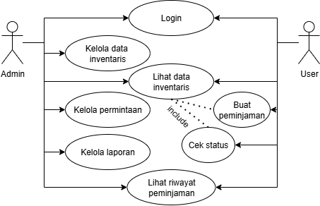

# InventoCorp - Sistem Peminjaman IT

## Deskripsi Project
InventoCorp adalah sistem untuk mengelola peminjaman perangkat IT seperti laptop, mouse, keyboard, monitor, dll. Admin bisa kelola barang dan approve peminjaman, user bisa pinjam barang IT yang dibutuhkan.

## Use Case Diagram

### Actor
- **Admin**: Kelola inventaris IT dan approve peminjaman
- **User**: Pinjam perangkat IT

### Fitur Utama

#### 🔐 Login
Masuk ke sistem pakai username/password

#### 📱 Kelola Data Inventaris (Admin)
- Tambah perangkat IT baru 
- Edit info perangkat
- Hapus perangkat rusak

#### 👀 Lihat Data Inventaris (Admin & User)
Cek daftar perangkat IT yang tersedia

#### ✅ Kelola Permintaan (Admin)
- Terima atau tolak request peminjaman
- Update status peminjaman

#### 📝 Buat Peminjaman (User)
- Pilih perangkat IT yang mau dipinjam
- Isi form: tanggal pinjam, tanggal balik, keperluan
- Kirim request ke admin

#### 🔍 Cek Status (User)
Cek apakah request peminjaman di-approve atau ditolak

#### 📊 Kelola Laporan (Admin)
Bikin laporan peminjaman IT bulanan/tahunan

#### 📚 Lihat Riwayat Peminjaman (Admin & User)
Lihat histori peminjaman yang udah selesai

## Flow Sistem

**User:**
Login → Lihat inventaris → Buat peminjaman → Cek status → Kembalikan barang

**Admin:** 
Login → Kelola inventaris → Approve/reject peminjaman → Bikin laporan

## Tech Stack
- Backend: Laravel/Node.js
- Database: MySQL
- Frontend: React/Vue
- Auth: JWT

## Database
- users (admin/user)
- inventory (laptop, mouse, dll)
- borrowing_requests (pending/approved/rejected)
- borrowing_history

## Rules
- Login wajib
- Barang available baru bisa dipinjam
- Satu user cuma bisa pinjam satu barang yang sama
- Admin wajib proses request max 3 hari